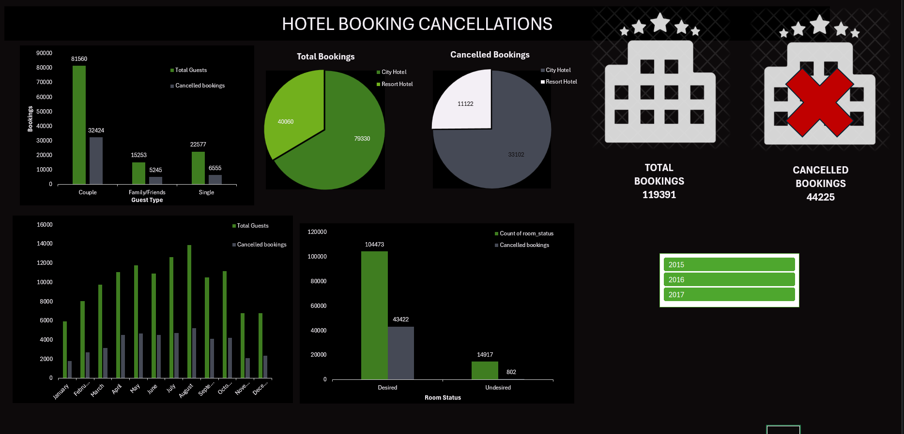

# Hotel Booking Analysis

This is a data analysis project that explores and visualizes hotel booking data to understand cancellation patterns and booking behaviors. This is my very first data analysis project, created entirely using Microsoft Excel.

## Files

- **Hotel_Bookings.xlsx**  
  Contains:
  - `hotel_booking` – Cleaned dataset
  - `Pivot` – Pivot tables used for dashboard
  - `Dashboard` – Visualized summary of key insights
  
- **dashboard.png**  
  A screenshot of the final Excel dashboard

---

## Dashboard Overview

### Key Insights:
- **Total Bookings**: 119,391  
- **Cancellations**: 44,225 (~37%)  
- **Couples** booked the most rooms, but also had the highest cancellations.
- **City Hotels** saw more cancellations than Resort Hotels.
- **Room Preference** impacts cancellations: undesired room types had fewer bookings and very few cancellations.
- **Seasonality**: Cancellations peak between **June and August**.
  
---

##  Tools Used

- **Microsoft Excel**
  - Data Cleaning
  - Pivot Tables
  - Dashboard Creation

---

##  Future Plans

This is just the beginning! I plan to recreate this analysis using:
- Python
- Power BI/Tableau

